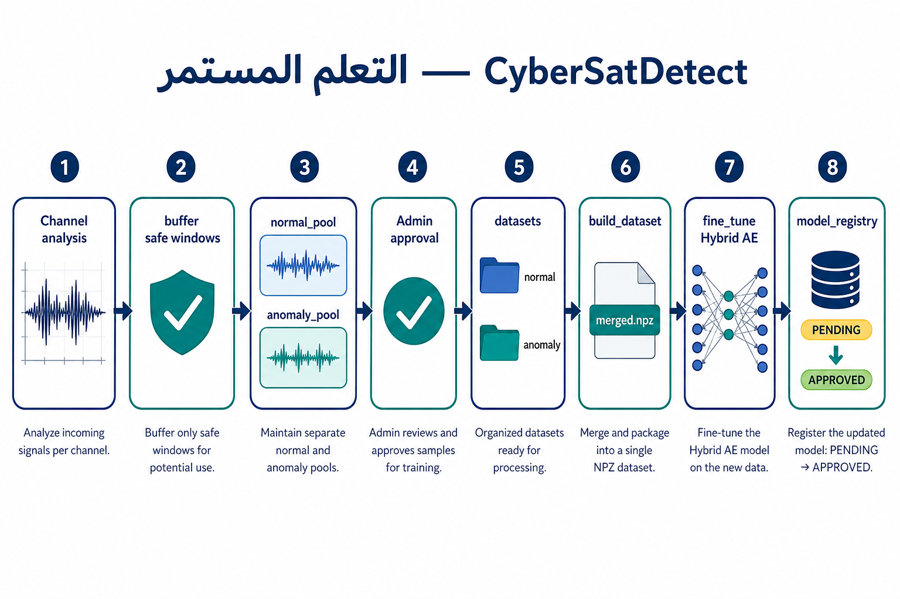
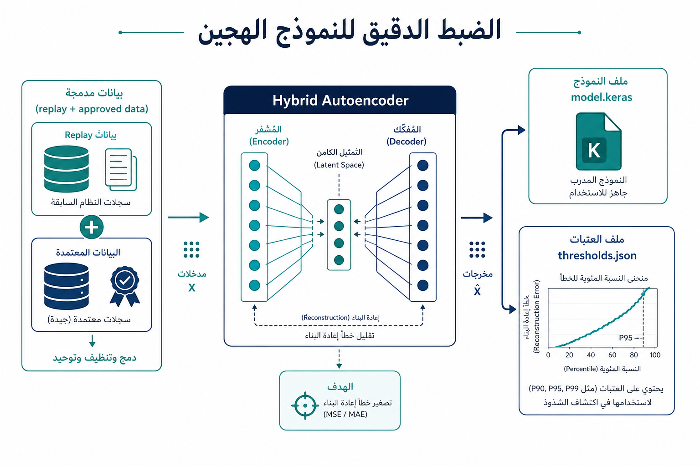
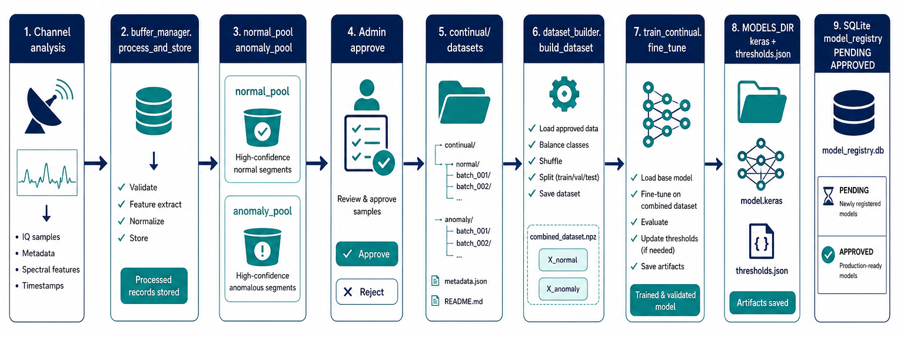
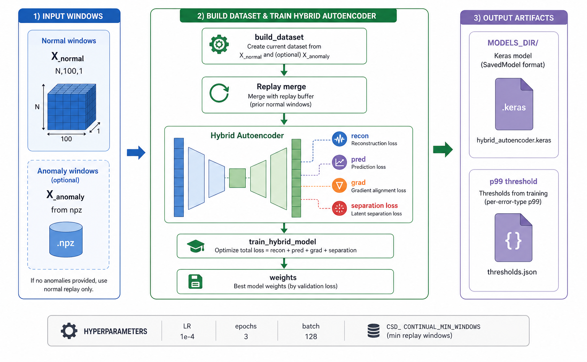
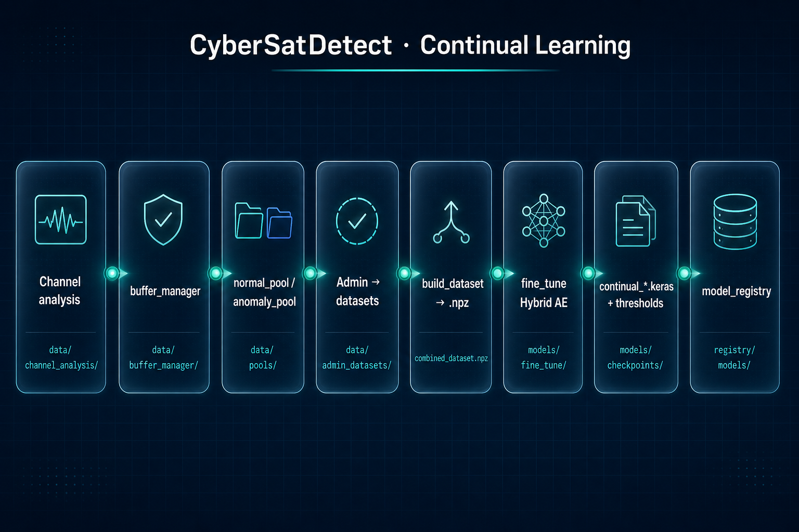
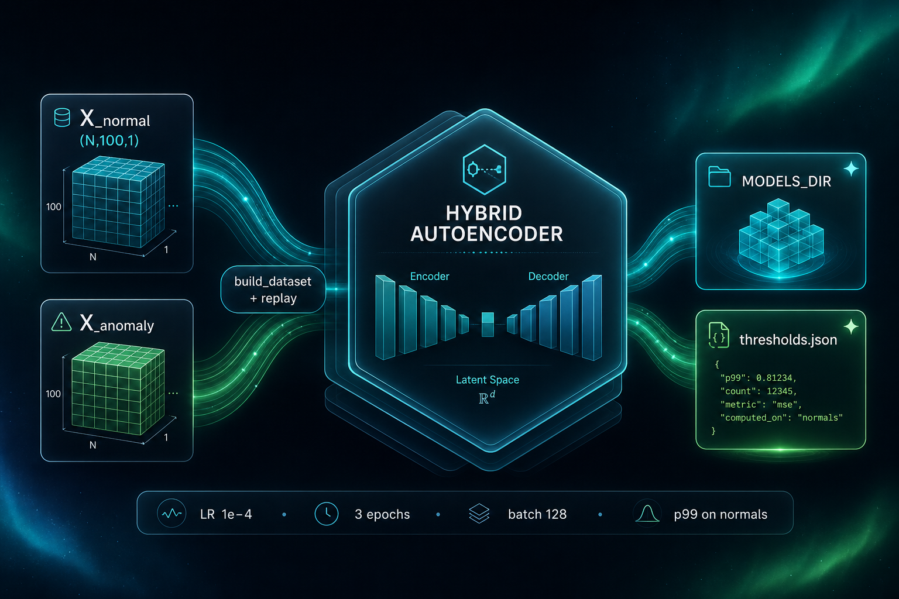
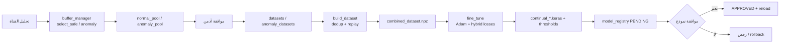

# دليل التعلم المستمر (Continual Learning) — مشروع CyberSatDetect

هذا المستند يشرح **بالتفصيل** مسار التعلم المستمر في الكود الحالي: المجلدات، المعاملات، دوال التدريب، وواجهات الإدارة. المراجع في الكود: `backend/continual/` و`backend/app/api.py` و`backend/models/train_hybrid_model.py`.

### رسوم توضيحية

كل الصور المُنتَجة محفوظة في `docs/images/` كملفات **منفصلة** (لا يُستبدل ملف بآخر).

#### عربي — مسار عام

**أ) تدفق التعلم المستمر** — من التحليل إلى السجل والموافقة.

**ب) الضبط الدقيق ومخرجات النموذج الهجين**

#### إنجليزي — مطابقة مسارات ودوال النظام (خلفية فاتحة)

**أ)** مسار البيانات مع أسماء المستودع (`buffer_manager`, `combined_dataset.npz`, `model_registry`, …).

**ب)** مدخلات/مخرجات `fine_tune` وأبعاد النوافذ ومخرجات `MODELS_DIR`.

#### إنجليزي — نسخة عرض (داكنة)

**أ)** نفس الفكرة العامة بأسلوب انفوجرافيك داكن للعروض والواجهات.

**ب)** النموذج الهجين والمخرجات — نسخة داكنة.

> ملاحظة: الصور مولَّدة آلياً؛ للمخطط النصي القابل للتحرير انظر القسم 9 (Mermaid).

---

## 1. الهدف والفكرة العامة

- **الهدف**: تحديث نموذج **كشف الشذوذ الهجين (Hybrid Autoencoder)** تدريجياً باستخدام نوافذ زمنية جديدة من التشغيل الفعلي، دون إعادة تدريب كامل من الصفر في كل مرة.
- **الأسلوب**: تحميل النموذج **الإنتاجي الحالي** (أو المحدد بمتغير البيئة)، ثم **ضبط دقيق قصير (fine-tuning)** على بيانات طبيعية (مع شذوذ اختياري معتمد)، ثم حفظ **نسخة جديدة** ملفاً `.keras` وملف **عتبات** `*_thresholds.json`، وتسجيلها في **`model_registry`** حتى تُوافق عليها الإدارة.

---

## 2. هيكل المجلدات والبيانات

| المسار (نسبة إلى `backend/data/`) | الوصف |
|-------------------------------------|--------|
| `continual/normal_pool/` | دفعات `.npy` لنوافذ **طبيعية مقترحة** (قبل موافقة الأدمن). |
| `continual/datasets/` | نوافذ طبيعية **بعد الموافقة** — مصدر أساسي لـ `build_dataset`. |
| `continual/anomaly_pool/` | دفعات شذوذ مقترحة قبل الموافقة. |
| `continual/anomaly_datasets/` | شذوذ **بعد الموافقة**. |
| `combined_normal.npy` | مخرجات `build_dataset`: كل النوافذ الطبيعية المجمّعة بعد المعالجة. |
| `combined_anomaly.npy` | مخرجات اختيارية للشذوذ المعتمد. |
| `combined_dataset.npz` | الحزمة المضغوطة التي يقرأها `fine_tune`: مفاتيح `X_normal` واختيارياً `X_anomaly`. |
| `combined.npy` | Legacy — يُستخدم في replay إن وُجد. |
| `chunks/*.npy` | قد تُختار كأكبر مصدر تدريب عند استدعاء مسار التدريب من الـ API (انظر القسم 6). |
| `backend/models/` (`MODELS_DIR` في `continual/config.py`) | حفظ نماذج التعلم المستمر بأسماء مثل `continual_YYYYMMDD_HHMMSS_<uuid>.keras`. |

**ملاحظة مسارات**: في `api.py` تُنشأ أيضاً مجلدات تحت `backend/app/data/continual/...` للتطبيق؛ `continual/config.py` يستخدم `backend/data/continual/...`. عند النشر راقب أن **مصادر البيانات** التي تبنيها الواجهة تطابق ما يقرأه `build_dataset` و`select_largest_chunk_dataset`.

---

## 3. المكوّنات البرمجية (ملفات رئيسية)

| الملف | الوظيفة |
|--------|---------|
| `continual/config.py` | ثوابت المسارات، أبعاد النافذة، معاملات التدريب الآمنة، متغيرات البيئة. |
| `continual/buffer_manager.py` | اختيار نوافذ «آمنة» طبيعياً ونوافذ شاذة قوية من نتائج التحليل، وحفظها في الـ pools. |
| `continual/dataset_builder.py` | دمج المعتمد، إزالة التكرار، replay، كتابة `combined_dataset.npz`. |
| `continual/train_continual.py` | `fine_tune`: تحميل النموذج الأساسي، حلقة TensorFlow، معايرة العتبة، الحفظ. |
| `continual/test_buffer.py` | اختبارات وحدة للـ buffer (إن وُجدت). |
| `models/train_hybrid_model.py` | يُحمّل ديناميكياً لاستيراد دوال الخسارة والأوزان (`W_*`, `ANOMALY_MARGIN`, `batch_scores_tf`, إلخ). |
| `app/api.py` | نقاط `/admin/continual/*`، جدول `model_registry`، اختيار أكبر dataset، الموافقة على النموذج والتراجع. |

---

## 4. المعاملات والثوابت (جدول مرجعي)

### 4.1 `continual/config.py`

| الاسم | القيمة الافتراضية | الوصف |
|--------|-------------------|--------|
| `WINDOW_LEN` | `100` | طول النافذة الزمنية (خطوات). |
| `N_FEATURES` | `1` | بعد الميزة لكل خطوة زمنية. |
| `SAFE_THRESHOLD_RATIO` | `0.5` | حد أمان لاختيار النوافذ الطبيعية: `safe_limit = 0.5 * threshold` (مع منطق مئيني إضافي في `buffer_manager`). |
| `MAX_WINDOWS_PER_RUN` | `500` | أقصى عدد نوافذ تُؤخذ من **تشغيل تحليل واحد** للطبيعي أو الشذوذ. |
| `TARGET_DATASET_SIZE` | `10000` | بعد الدمج والتنظيف: إن زاد عدد النوافذ الطبيعية يُقصّ إلى هذا الحد. |
| `LEARNING_RATE` | `1e-4` | معدل التعلم في **التعلم المستمر** (أقل من تدريب `train_hybrid_model` الكامل عادةً). |
| `EPOCHS` | `3` | عدد «الحقب» المنطقية في `fine_tune` (عبر `repeat` على الـ dataset). |
| `BATCH_SIZE` | `128` | حجم الدفعة في `fine_tune`. |
| `MIN_DATASET_SIZE_FOR_TRAIN` | `512` (قابل للتعديل) | لا يبدأ التدريب إلا إذا وُجدت على الأقل هذا العدد من نوافذ الطبيعي. يُضبط عبر **`CSD_CONTINUAL_MIN_WINDOWS`** (قيمة صحيحة ≥ 1). |
| `ADMIN_APPROVAL_REQUIRED` | `False` | علم في الإعدادات (قد لا يربط كل مسارات الـ API بنفس السلوك — راجع منطق الموافقة على النماذج في `api.py`). |
| `BASE_MODEL_PATH` / `BASE_THRESHOLD_PATH` | `app/final_model.keras`, `app/thresholds.json` | مرجعية توثيقية؛ مسار التحميل الفعلي في `fine_tune` يمرّ بـ `_pick_base_model_path()` (انظر 4.3). |
| `MODELS_DIR` | `backend/models` | مجلد حفظ نسخ التعلم المستمر. |

### 4.2 `models/train_hybrid_model.py` (يُستورد أثناء `fine_tune` — أوزان الخسارة وهامش الفصل)

هذه القيم تُستخدم في **دالة الخسارة** داخل `train_continual.py` بعد تحميل الوحدة:

| الاسم | القيمة | المعنى |
|--------|--------|--------|
| `W_RECON` | `1.0` | وزن خسارة إعادة البناء (MSE بين المدخل والإعادة). |
| `W_PRED` | `2.0` | وزن التنبؤ بالخطوة الأخيرة. |
| `W_GRAD` | `2.0` | وزن خسارة التدرج (مقارنة تدرجات الإشارة). |
| `W_SEP` | `0.5` | وزن خسارة **الفصل** بين درجات الطبيعي والشاذ/الوهمي. |
| `ANOMALY_MARGIN` | `0.15` | هامش في `relu(margin - (score_anom - score_normal))` لتعليم الفصل. |

**ملاحظة**: تدريب **الخط الأساسي الكامل** في `train_hybrid_model.py` يستخدم افتراضياً `BATCH_SIZE = 256` و`LEARNING_RATE = 1e-3` و`EPOCHS_PER_CHUNK = 1` — هذه **خاصة بالتدريب الطويل** وليست نفس أرقام `continual/config.py` المستخدمة في `fine_tune`.

### 4.3 اختيار النموذج الأساسي في `train_continual._pick_base_model_path()`

1. إن وُجد **`CSD_MODEL_PATH`** في البيئة → يُستخدم هذا المسار.
2. وإلا يُبحث عن **`best_model.keras`** ثم **`final_model.keras`** تحت `backend/app/`.
3. الافتراضي النهائي إن لم يوجد ملف: مسار `app/best_model.keras` (قد يرفع `FileNotFoundError` إن لم يُنشأ).

### 4.4 `buffer_manager.py` — معاملات اختيار النوافذ

| المعامل / المنطق | القيمة أو السلوك |
|------------------|-------------------|
| طبيعي «آمن» | `scores <= SAFE_THRESHOLD_RATIO * threshold` **و** `scores <= percentile(scores, 30)`. |
| Fallback طبيعي | إن لم يوجد شيء: أقل `300` درجة أو كل الدرجات إن أقل. |
| تخفيف التكرار للطبيعي | `step = max(1, safe_indices.size // MAX_WINDOWS_PER_RUN)` ثم أخذ `MAX_WINDOWS_PER_RUN` كحد أعلى. |
| شذوذ «قوي» | `scores >= threshold` **و** `scores >= percentile(scores, 90)`. |
| Fallback شذوذ | أعلى `200` نافذة بالدرجة إن لم يتحقق الشرط السابق. |
| استبعاد نوافذ ثابتة | `std(window) < 1e-5` تُستبعد. |

### 4.5 `dataset_builder.build_dataset` — أرقام مهمة

| المنطق | القيمة / النسبة |
|--------|-----------------|
| تقسيم replay بسيط داخل الطبيعي | حوالي `70%` قديم / `30%` جديد (بعد الترتيب الأصلي ثم خلط). |
| حد الشذوذ مقارنة بالطبيعي | `cap_a = max(100, int(0.25 * N_normal))`؛ يُقصّ إذا زادت العينات. |
| الحد الأدنى لإنشاء dataset | إن `Xn.shape[0] < 50` يُرجع `None` ولا يُنشأ ملف. |
| Replay من التاريخ (`anti-forgetting`) | `replay_k = min(int(0.3 * Xn.shape[0]), X_prev.shape[0], 3000)` ثم دمج `X_prev[:replay_k]`. |

### 4.6 `train_continual.fine_tune` — تقسيم التحقق ومعايرة العتبة

| المعامل | القيمة |
|---------|--------|
| بذرة عشوائية NumPy | `42` (خلط المؤشرات قبل التقسيم). |
| تقسيم train/val على الطبيعي | `split = max(1, int(0.9 * n))` → 90% تدريب، 10% تحقق. |
| `tf.keras.utils.set_random_seed` | `42` |
| حجم buffer الخلط في `tf.data` | `min(20000, max(N_train, 1))` |
| خطوات التدريب | `steps_per_epoch = ceil(N_train / BATCH_SIZE)` × `EPOCHS` |
| عتبة المعايرة للـ TNR | **`p99`** على **درجات التدريب الطبيعية فقط**: `thr_star = quantile(train_scores, 0.99)` |
| `accuracy` المعاد للـ API | `mean(val_scores < thr_star)` مقيّد بين `0` و `1` (بروكسي **معدل true negative** للطبيعي تحت عتبة p99 التدريب). |

### 4.7 محتوى `*_thresholds.json` (من `_save_threshold_json`)

يُحسب على **`cal_scores` = concat(train_scores, val_scores)** (كلها طبيعية بعد التدريب):

- `mean`, `std`
- `thresholds`: `3sigma`, `p99`, `p995`, `p997`
- `weights`: نسخ من `W_RECON`, `W_PRED`, `W_GRAD`, `W_SEP`
- `self_supervised`: وصف pseudo anomalies ومفتاح `anomaly_margin`

---

## 5. مسار الخسارة في `fine_tune` (ملخص تحليلي)

لكل دفعة طبيعية `batch`:

1. **إعادة بناء + تنبؤ**: `recon, pred = model(batch, training=True)`.
2. **`loss_recon`**: MSE بين `batch` و`recon`.
3. **`loss_pred`**: MSE بين آخر خطوة في `batch` والتنبؤ.
4. **`loss_grad`**: مقياس تدرجي من `train_hybrid_model` (`grad_mse`).
5. **`normal_scores`**: درجات هجينة على الدفعة الطبيعية.
6. **الفصل (`loss_sep`)**:
   - إن وُجدت دفعة شذوذ حقيقية متزامنة `anom_batch` → درجات الشذوذ مقابل الطبيعي، خسارة `relu(margin - (anom_scores - normal_scores))`.
   - وإلا → **`pseudo_batch`** من `build_pseudo_anomalies(batch)` بنفس المنطق.
7. **`total_loss`** = مجموع الأوزان كما في الجدول 4.2.
8. **تحديث الأوزان** بـ Adam بمعدل `LEARNING_RATE` من `continual/config.py`.

**قيد تصميم مهم**: معايرة العتبة في التعليق صراحةً على **النوافذ الطبيعية فقط** — لا تخلط درجات الشذوذ في حساب عتبة p99 للـ TNR المعروض.

---

## 6. واجهات الإدارة (FastAPI) — ملخص

| الطريقة | المسار | الوظيفة |
|---------|--------|---------|
| GET | `/admin/continual` | صفحة ويب إدارة (ملف HTML مرفق). |
| GET | `/admin/continual/status` | حالة `TRAINING_STATUS` (قد تُحدَّث بشكل كامل عند استخدام مسار الخلفية إن وُصِل لاحقاً). |
| GET | `/admin/continual/models` | قائمة `model_registry`. |
| GET | `/admin/continual/normal-files` | قائمة ملفات `normal_pool`. |
| GET | `/admin/continual/normal-data` | معاينة ملف طبيعي (`view=series|windows`). |
| POST | `/admin/continual/approve-normal` | نقل ملف من `normal_pool` → `datasets`. |
| POST | `/admin/continual/reject-normal` | حذف ملف من `normal_pool`. |
| GET | `/admin/continual/datasets` | قائمة `datasets`. |
| GET/POST | `/admin/continual/anomaly-*` | نظير للشذوذ (`anomaly_pool` / `anomaly_datasets`). |
| POST | `/admin/continual/build-dataset` | استدعاء `build_dataset()` وتحديث رسالة الحالة. |
| POST | `/admin/continual/train` | يختار **`select_largest_chunk_dataset()`** (أكبر مصدر بين chunks، continual datasets، إلخ) ثم **`fine_tune` متزامناً**، ثم إدراج في `model_registry` بحالة `PENDING`. |
| POST | `/admin/continual/approve/{version}` | تفعيل نسخة: رفض البقية، `APPROVED` لهذه، إعادة تحميل النموذج في الذاكرة. |
| POST | `/admin/continual/rollback/{version}` | تراجع: رفض كل السجلات، العودة لنموذج مُجمّع (انظر تعليقات الكود حول `best_model.keras`). |

**دالة `run_continual_training_in_background`**: موجودة في `api.py` وتحدّث `TRAINING_STATUS` بشكل كامل؛ قد لا تكون مربوطة بمسار HTTP في النسخة الحالية — راجع المشروع عند دمج الواجهة الأمامية.

---

## 7. تدفق العمل الموصى به (تشغيلي)

1. بعد تحليل قناة: استدعاء **`process_and_store`** (من الـ buffer) لملء `normal_pool` و`anomaly_pool`.
2. مراجعة الأدمن عبر الواجهة أو الـ API.
3. **موافقة** الملفات الجيدة → `datasets` / `anomaly_datasets`.
4. **`POST /admin/continual/build-dataset`** لإنشاء `combined_dataset.npz`.
5. **`POST /admin/continual/train`**: يختار حالياً **أكبر** ملف تدريب متاح (قد يكون chunk وليس فقط الـ combined) — راقب هذا السلوك إن أردت التدريب **فقط** على المعتمد.
6. مراجعة **`accuracy`** والمسارات، ثم **`POST .../approve/{version}`** أو رفض/تراجع.

---

## 8. مخاطر وجودة (للمحلل والمشغّل)

- **تلوث التسمية**: النوافذ «الطبيعية» المختارة آلياً قد تحتوي شذوذاً خفياً؛ الموافقة البشرية خط الدفاع الأول.
- **`accuracy`**: بروكسي TNR تحت p99 على جزء التحقق — لا يغني عن تقييم FAR/F1 على بيانات مرجعية.
- **نسيان كارثي**: مُخفّض عبر replay من `combined_*` السابق في `build_dataset`، لكنه لا يضمن أداءً مطابقاً للنسخة القديمة على كل التوزيعات.
- **اتساق المسارات**: تحقق يدوياً من أن `backend/data` مقابل `app/data` في بيئتك يشيران لنفس التخزين إن لزم.

---

## 9. مخطط تدفق مبسّط (Mermaid)

---

## 10. مراجع الملفات في المستودع

- `backend/continual/config.py`
- `backend/continual/buffer_manager.py`
- `backend/continual/dataset_builder.py`
- `backend/continual/train_continual.py`
- `backend/app/api.py` (أقسام continual و`model_registry`)
- `backend/models/train_hybrid_model.py`

---

*آخر تحديث للمستند وفقاً لحالة الكود في المستودع؛ عند تغيير الثوابت أو المسارات حدّث هذا الملف أو أضف تاريخ المراجعة.*
